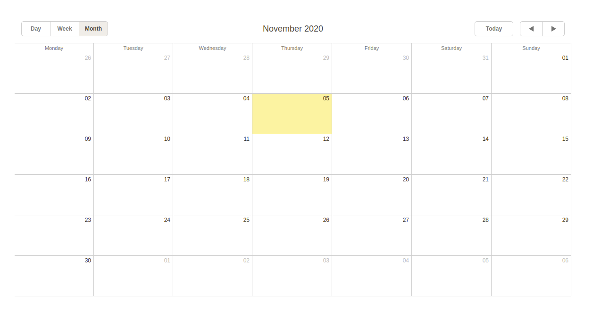

# User calendar

Shared calendar for Open edX Users.

Users can add/edit/delete his/her event on google calendar in openedx.

## Reference
    https://github.com/raccoongang/edx-calendar-tab.git

## Installation

    sudo -H -u edxapp bash
    source /edx/app/edxapp/edxapp_env
    cd ~/edx-platform/
    git clone https://github.com/kavahitesh1996/user_calendar.git
    pip install -e user_calendar/

## Configuration

### Configure google service account

Google service accounts [documentation](https://developers.google.com/identity/protocols/OAuth2ServiceAccount).

In general process consists of these steps:

* create new Project in [developers console](https://console.developers.google.com/projectselector/iam-admin/serviceaccounts);

* create new Service Account via Project (with "Owner" role);

* [enable] Google Calendar API via Project;

[enable]: https://console.developers.google.com/apis/dashboard

* [create] credentials for Service Account (service account key)

* save json-api-private-key - _you'll need to replace it on your server
  (into "/edx-platform/user_calendar/calendar_tab/edx-calendar-tab-google-api-private-key.json");

[create]: https://console.developers.google.com/apis/credentials

### Configure edx-platform

Add "calendar_tab" to installed Django apps

In "/edx/app/edxapp/edx-platform/lms/env/common.py" add:

    "INSTALLED_APPS": ["calendar_tab"],

and to the list of FEATURES add:

    "ENABLE_CALENDAR": True,

In "/edx/app/edxapp/edx-platform/lms/urls.py" add below URL

    if settings.FEATURES.get('ENABLE_CALENDAR'):
        urlpatterns += (
           url(
               r'^calendar/',
               include('calendar_tab.urls'),
               name='calendar_tab_endpoints',
           ),
        )
        
        
## Create Migrations 
    python manage.py lms makemigrations calendar_tab  --settings=production
    python manage.py lms migrate calendar_tab  --settings=production
    

## Basic usage

From the very beginning after calendar is enabled, there is no
any google calendar associated with current user, so user has to
initialize one at first time by submitting "Initiate google
calendar" button.

Application then creates new Google Calendar (from behalf of Google
service account) and associates it with the current user.
This Calendar is private and can't be seen out of service account.

After initialization new google calendar is rendered on it.

Students can create/update/delete events.

Events may be edited via dialog box(on double click), by dragging
(whole event or its start/end border).

## Installed

After installation you should get the following state.

* LMS's view (URL:domain/calendar/view/): 

